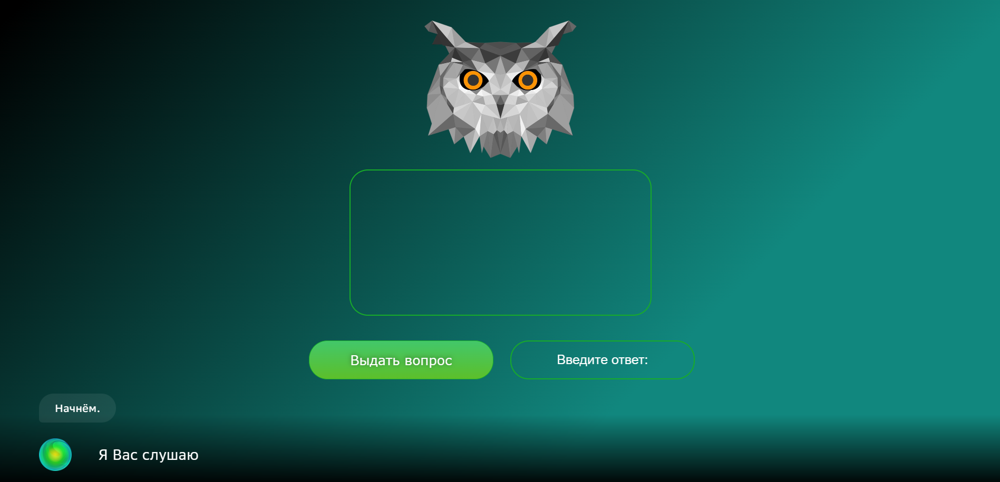

# Модуль "Что? Где? Когда?"

### Иструкция по сборке
Протестировано под Nodejs `18.15.0`..

1. У себя на диске в каталоге проекта копируем файл-пример `.env.sample` в файл `.env`. В файле `.env` указываем название `ЧГК`, в строке `REACT_APP_SMARTAPP`).
2. Указываем токен в файле `.env`, в строке `REACT_APP_TOKEN`.
3. Установить нужную версию Nodejs можно либо непосредственно с сайта, либо (рекомендуется) с помощью утилиты `nvm`, позволяющей быстро переключаться между версиями Node из командной строки (`nvm install 18.15.0`, `nvm use 18.15.0`).
4. Установить менеджер пакетов `yarn`, установить зависимости и запустить:
   
```bash
npm install -g yarn
yarn
yarn start
```
Если после установки `yarn` при попытке его запустить вы получаете сообщение `The term 'yarn' is not recognized`, см. раздел "Устранение проблем".

Эти же команды в менеджере пакетов `npm` (уже установлен по умолчанию вместе с Nodejs):

```bash
npm install
npm start
```
5. Должен открыться веб-браузер со страницей приложения, в котором (кроме обычного визуального интерфейса) в нижней части появится панель Ассистента с шариком слева. Кликом на шарике можно включать/отключать распознавание речи. При отключенном распознавании текст можно вводить с клавиатуры в строке справа от шарика.
   
6. При вращающемся шарике в этом приложении доступны следующие голосовые команды:
  
Не забудьте разрешить доступ страницы к микрофону.

Если вам не нужно, чтобы новая вкладка браузера открывалась каждый раз при старте приложения, в файле `.env` добавьте строку

```dotenv
BROWSER=none
```

Внимание! При внесении изменений в файл `.env` приложение необходимо перезапустить.

# Создание docker-образа
Внесите необходимые изменения в .env.sample(Укажите корректный токен, а также название смартаппа)

```bash
docker build -t <image_name> .
```
Данный скрирт создаст docker-образ с именем, который вы ему дадите

Затем создадим контейнер следующей командой

```bash
docker run -p 3000:3000 --name <container_name> <image_name>
```

# Устранение проблем

## The term 'yarn' is not recognized

### Проблема

Если вы работаете в Windows, и после установки `yarn`, при попытке его запустить, вы получаете сообщение `The term 'yarn' is not recognized`:

```log
yarn : The term 'yarn' is not recognized as the name of a cmdlet, function, script file, or operable program. Check the spelling of the name, or if a path was included, verify that the path is correct and try again.
```

### Решение

В Windows настоящее время по умолчанию используется командная строка PowerShell. В некоторых случаях PowerShell не может найти команду `yarn` после установки. Наиболее простой способ решить эту проблему - запустить более старый командный процессор Cmd. В нём, как правило, всё работает.
В случае, если это не решает проблему, можно использовать оригинальный менеджер пакетов `npm`.
